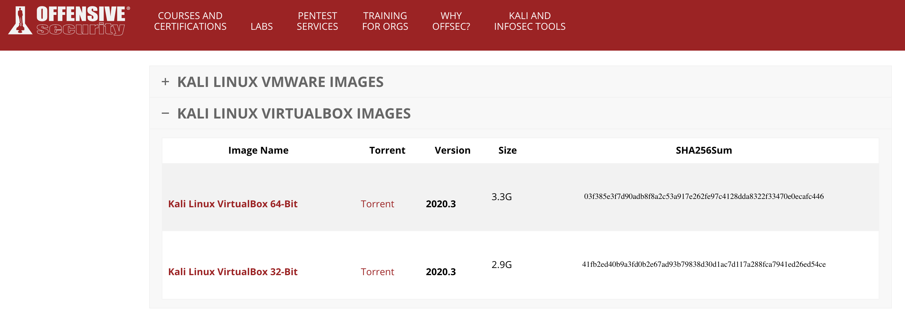
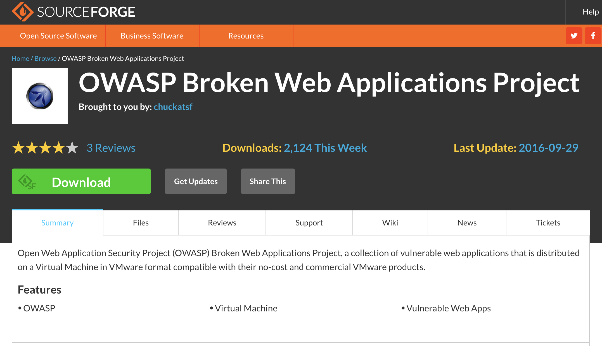
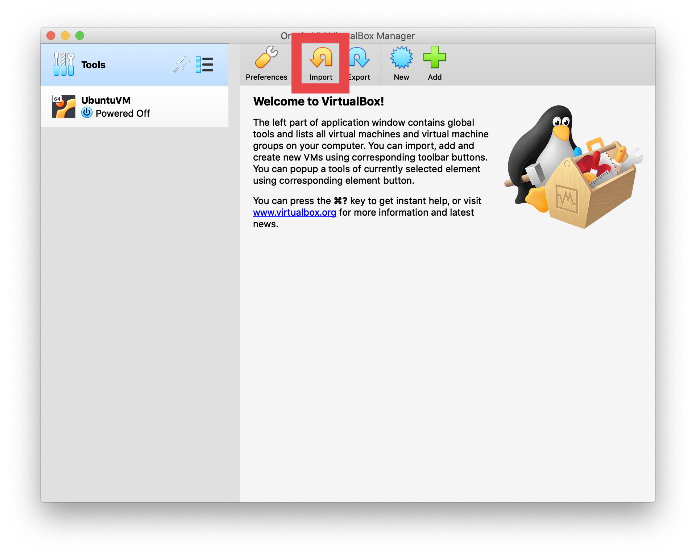

# OWASP-BWA_Setup
 Creating an OWASP-BWA server within VirtualBox

## OWASP-BWA w/Kali Access in VirtualBox ##

[Kali](https://www.offensive-security.com/kali-linux-vm-vmware-virtualbox-image-download/) - VirtualBox Image

[OWASP-BWA](https://sourceforge.net/projects/owaspbwa/) - VirtualBox Image

### Step 1 - Download Virtual Machine Images ###

Download each of the VirtualBox images above. Each of these will create the corresponding virtual machine within the VirtualBox environment. 

When downloading the `Kali` image, make sure you select the `64-Bit` version. (See images below.)

The `OWASP` download should be a `.zip` file. You will extract the contents to your desired location, preferably a dedicated VM Image folder to be sure the files aren't deleted by accident.

### Step 2 - Setting Up Kali VM ###

(If you already have Kali installed, skip to Step 3)

You will want to install these images by selecting the `Import` option in VirtualBox. We will start with the `Kali` installation below:

You will need to select the folder you placed the VirtualBox images into.

Once selected you should be taken back to the original Import Screen where you will click  `Continue`.

On the following screen, you will use the default settings. DO NOT CHANGE ANYTHING! Simply click `Import`.

On the window that pops up, you can choose to read the terms and conditions if you would like, however we both know you won't, so click `Agree` to proceed.

At this point, the import/installation of the Kali Virtual Machine should initiate and after a minute or so...POOF! You have Kali in your VirtualBox Application.

### Step 3 - Installing the OWASP-BWA in VirtualBox ###

Now we will setup the OWASP-BWA Virtual Machine using the zip folder that was previously downloaded from sourceforge.net. First you will want to extract the contents of the zipped folder. I recommend extracting the contents to the same folder you are currently keeping your VirtualBox images as previously mentioned.

Next you will return back to your VirtualBox application and select the `New` option instead of `Import` this time around.

From here you will name the VM, I named mine OWASP-BWA. Be sure to change the `Type` to `Linux` in the dropdown menu. The `Version` should be `Ubuntu (64-bit)`.

The next window will ask you select the memory allocated for the VM. Leave this as the default and click `Continue`.

On the next screen you will be asked to choose a `Hard Disk`. You will want to select the `Use an existing virtual hard disk file` option. You will then need to select the folder off to the right to navigate to the desire VirtualBox Image for this install. See below:

On the next screen you will want to select `Add` in the top left-hand corner.

From here you will navigate to the `OWASP_Broken_Web_Apps_VM_1.2` folder that was previously extracted. Inside of that folder you will find 6 virtual images. The one you want to select is `OWASP Broken Web Apps-cl1.vmdk`. This is the ONLY image that does not end with `cl1-s00_`. Once selected, click `Open`.

You will then be taken back to a previous screen where `OWASP Broken Web Apps-cl1.vmdk` should now appear under `Not Attached`. Select this image and click `Choose`.

You'll be taken back to the `Hard Disk` page where you should now see `OWASP Broken Web Apps-cl1.vmdk` listed in the drop-down menu. If that is the case, click `Create`.

The VM should be created almost instantaneously and you should now see the new OWASP-BWA VM within your VirtualBox.

### Step 4 - Configuring Kali and OWASP-BWA for Interaction ###

First we will setup the OWASP-BWA. Select the OWASP-BWA VM within VirtualBox and go to `Settings`.

From here you will navigate to `Network` > `Adapter 1`. You will want to change the `Attached to:` setting to `Host-only Adapter`. You can leave `Name:` as `vboxnet0`. Once those changes have been made, click `OK`.

Those are the only changes needed within OWASP-BWA and we will now move onto altering the Kali VM settings. Select the Kali VM within VirtualBox and select `Settings`.

Navigate to `Network` > `Adapter 2`. The first thing you need to do is check the `Enable Network Adapter` box.

Next you will select `Host-only Adapter` from the `Attached to:` drop-down menu. The `Name:` should remain `vboxnet0` or the same as your `OWASP-BWA` if you changed this option previously.

(_NOTE_ You do _NOT_ need to change anything on `Adapter 1`. Leave `Adapter 1` enabled and all other `Adapter 1` settings as they are.)

### Step 5 - Initializing the VMs! ###

We'll begin by starting the OWASP-BWA VM first. Select the `OWASP-BWA` and click the `Start` option.

OWASP should initialize as a headless server with an IP Address assigned and the login information listed. See below:

Enter `root` as the username and `owaspbwa` as the password to login to the server.

Once logged in, go ahead and return to VirtualBox to launch the Kali VM. Select Kali VM and, again, click `Start`.

Unless previously changed by you, the default login information for the Kali VM will be Username: `kali` and Password: `kali`.

Navigate to the Web Browser in Kali's "Start menu".

In the URL, use the displayed IP address shown in your OWASP-BWA machine as seen below:

Once entered, you should see the screen below! Enjoy!

